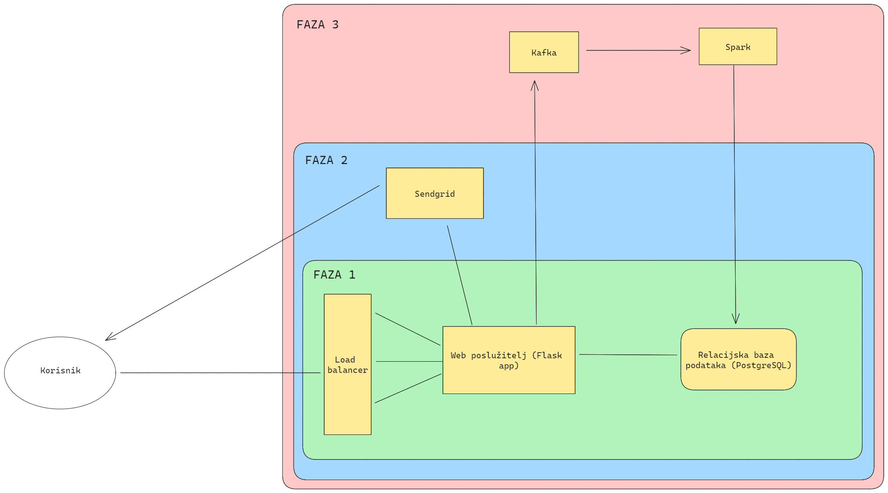
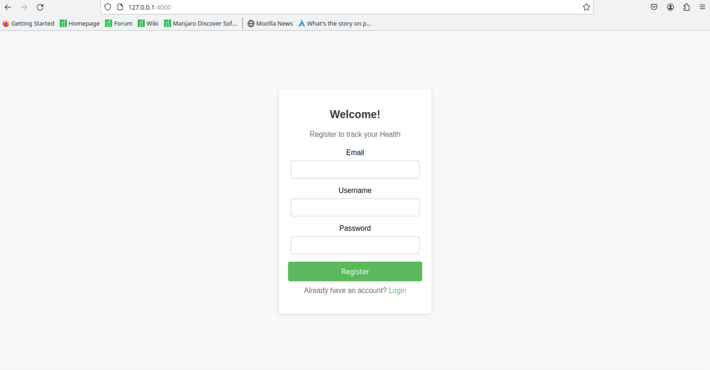
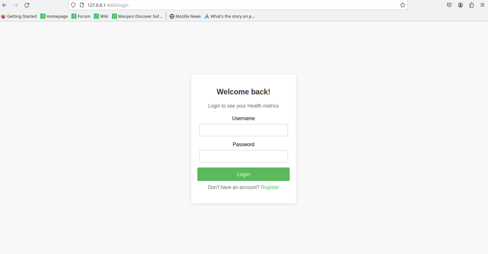
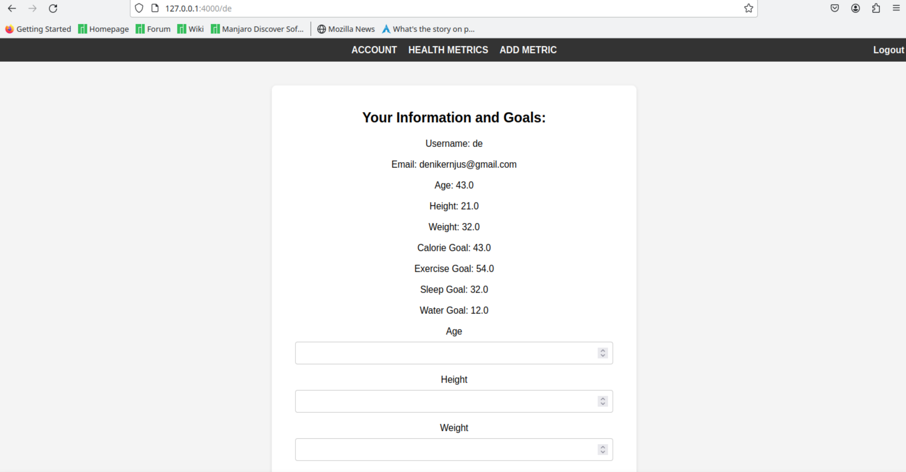
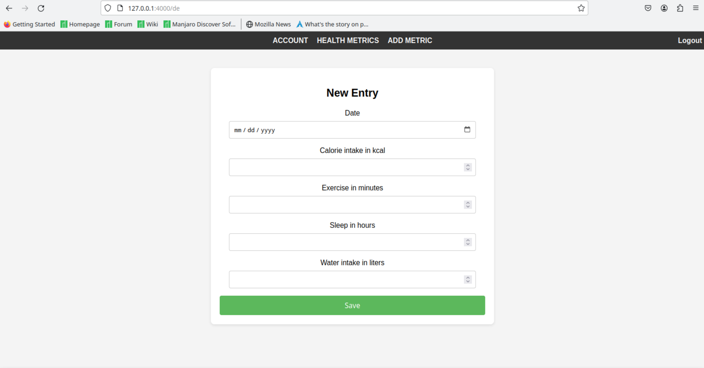
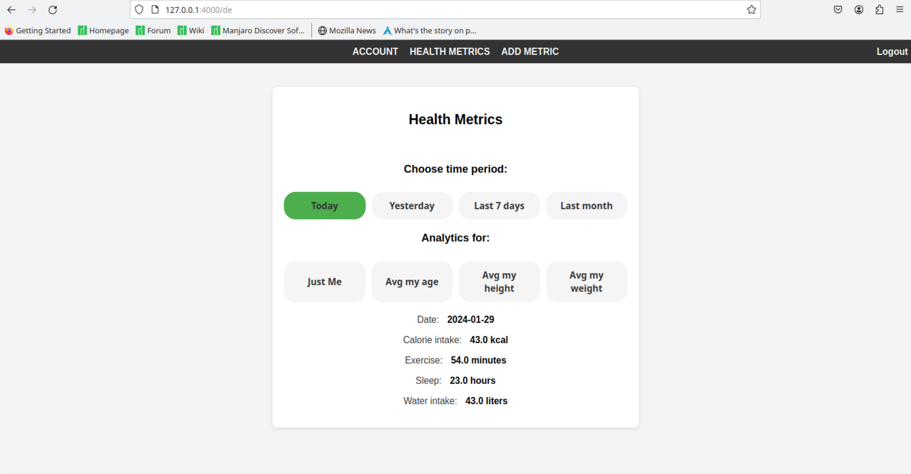

# Health tracker application

This repository contains a small Flask application in which users can track their health metrics and compare them to those of other users.

Technology used:
- [**Flask**](https://flask.palletsprojects.com/en/3.0.x/): lightweight and flexible web application framework for Python
- [**Htmx**](https://htmx.org/): a modern web development tool that allows you to access AJAX, CSS Transitions, WebSockets, and server-sent events directly in HTML, using attributes
- [**PostgreSQL**](https://www.postgresql.org/): open-source, advanced object-relational database management system (DBMS)
types of data, and is widely used for log and event data analysis and full-text search
- [**Docker**](https://www.docker.com/): open-source platform that automates the deployment, scaling, and management of applications inside lightweight, portable containers
- [**Apache Spark**](https://spark.apache.org/): a multi-language engine for executing data engineering, data science, and machine learning on single-node machines or clusters
- [**Apache Kafka**](https://kafka.apache.org/): an open-source stream-processing software platform
- [**Nginx**](https://www.nginx.com/): an open-source web server that also serves as a reverse proxy, load balancer, mail proxy, and HTTP cache, known for its high performance, stability, rich feature set, simple configuration, and low resource consumption.


## Application instructions

Firstly, you need to clone this repository into an empty folder on your machine:
```shell
git clone https://github.com/abyssis11/Health-tracker.git
```

Then position yourself inside the cloned repository:
```shell
cd Health-tracker/
```

Then, you can build and start Docker containers with:
```shell
sudo docker-compose up --build
```

All application dependencies are installed inside the containers and can be found in the 'requirements.txt' files.

After executing the previous command, all Docker containers should start. **NOTE**: It is advised to only test the application after all containers are ready.

Once all containers are ready, the application will be available at http://localhost:4000/

**Things that will go wrong**:
- Problem: some other services use the same port as one of the containers
    - Solution: stop and remove that container
- Problem: some other container uses same name
    - Solution: stop and remove that container
- Problem: PostgreSQL container starts before flask_app container
    - Solution: this happened 1 in 100 times to me, and the simplest solution is to try again
- Problem: Spark fails
    - Solution: simplest solution is to try again

## How it looks






